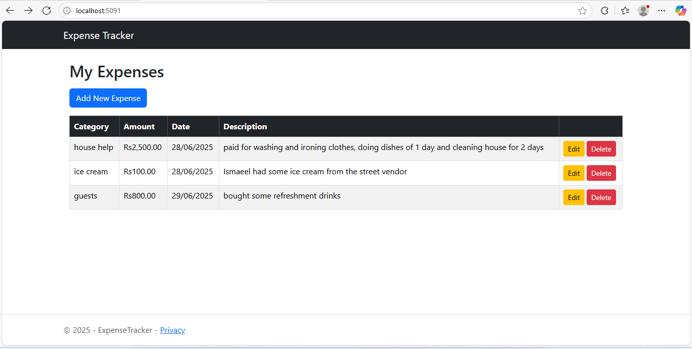
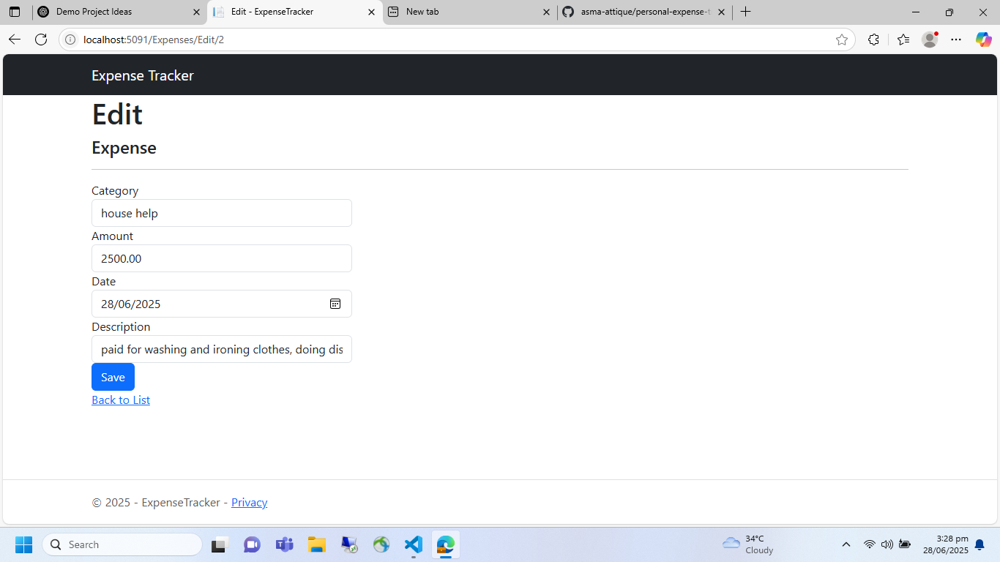
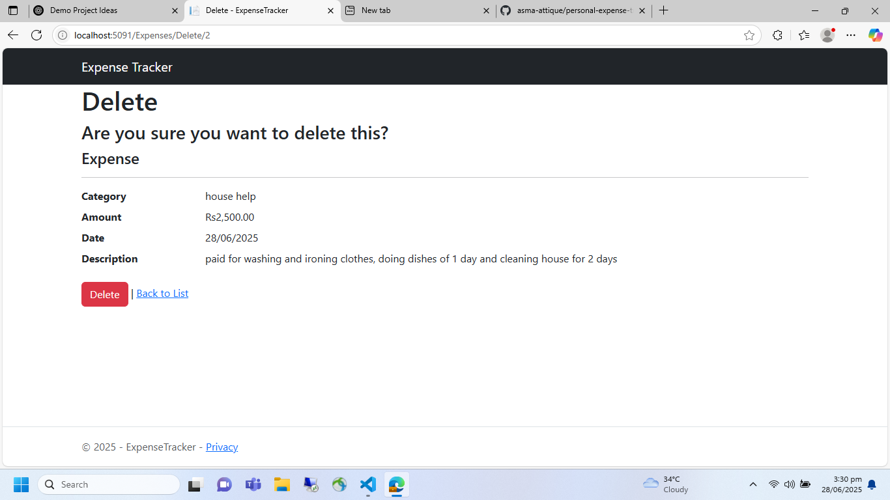

=======
# 💸 Personal Expense Tracker

A simple, clean **ASP.NET Core MVC web application** to track your personal expenses.  
Built using **Entity Framework Core**, **SQLite**, and **Bootstrap 5** for a responsive, user-friendly design.

---

## 🚀 Project Overview

This demo project lets you:
- Add, edit, and delete expenses
- View all expenses in a neat, responsive table
- Store data securely with SQLite
- Practice real-world ASP.NET Core MVC architecture

---

## 📸 Screenshots

### ➕ Expenses Page
Shows all saved expenses with 'Add New Expense' and Edit/Delete options.



### ✏️ Edit Page 
Form for editing expense details.



### 🗑️ Delete Page
Form for deleting expense details.



---

## ⚙️ Tech Stack

| Layer        | Details                                |
|--------------|----------------------------------------|
| **Framework**| ASP.NET Core MVC (.NET 8)              |
| **Database** | SQLite with Entity Framework Core      |
| **Frontend** | Razor Pages, Bootstrap 5               |
| **IDE**      | Visual Studio Code                     |

---

## 📂 Project Structure

```plaintext
ExpenseTracker/
│
├── Controllers/         # MVC controllers (ExpensesController.cs)
├── Models/              # Entity models (Expense.cs)
├── Data/                # Database context (AppDbContext.cs)
├── Views/
│   ├── Expenses/        # CRUD Razor Views
│   ├── Shared/          # _Layout.cshtml, _ViewStart.cshtml
├── Screenshots/         # Project screenshots for docs
├── wwwroot/             # Static files, Bootstrap, CSS
├── appsettings.json     # App config
├── Program.cs           # Entry point
├── expenses.db          # SQLite database (local, optional)
├── .gitignore           # Git ignore rules
└── README.md            # Project README

---

## 🛠️ How to Run Locally

1. **Clone the repository**

   ```bash
   git clone https://github.com/asma-attique/personal-expense-tracker.git
   cd expense-tracker-demo

2. **Restore and build**

   ```bash
   dotnet restore
   dotnet build

3. **Create the database**

   ```bash
   dotnet ef migrations add InitialCreate
   dotnet ef database update

4. **Run the application**

   ```bash
   dotnet run

5. **Open your browser and go to: https://localhost:5091/Expenses**

## 🎨 Visual Styling
    - Bootstrap 5 for a clean, responsive layout
    - Modern navbar for easy navigation
    - Styled tables and forms for better UX
    - Easy to customize further with site.css in wwwroot/css

## ✅ What I Learned
    - Developing an end-to-end ASP.NET Core MVC CRUD app
    - Using Entity Framework Core with SQLite
    - Scaffolding controllers and views for faster development
    - Keeping a clean, deployment-ready project structure

## 🌐 Demo Link 
    https://your-live-demo-url.com

## 👤 Author
    Asma Attique
